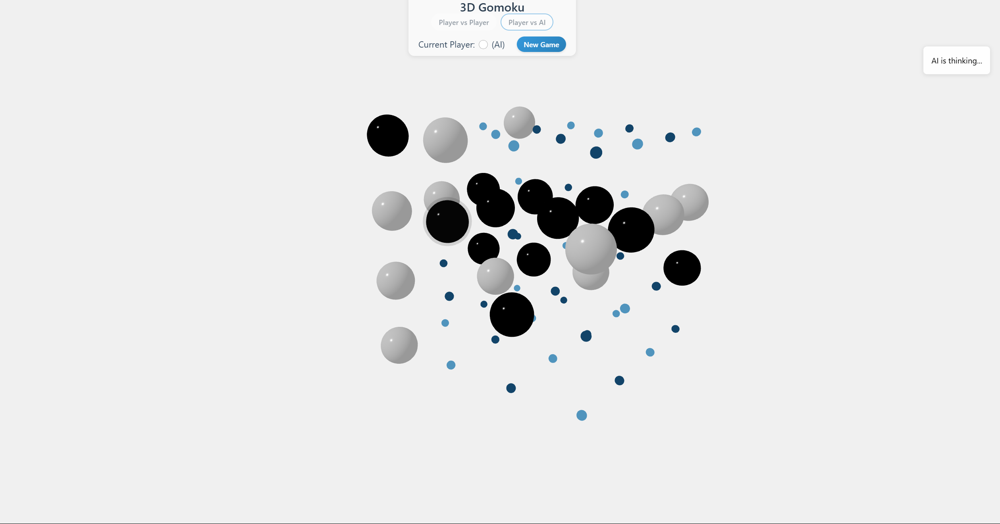

# 3D Gomoku with AlphaZero AI

A 3D implementation of the classic Gomoku (Five-in-a-Row) game, featuring an AlphaZero-powered AI opponent. This project combines a React/Three.js frontend with a Python/TensorFlow backend for an immersive 3D gaming experience.



## Game Overview

3D Gomoku extends the traditional 2D game into three dimensions:
- Play on a 4×4×4 cubic grid
- Win by placing 4 stones in a row in any direction (horizontal, vertical, diagonal, or 3D diagonal)
- Challenge the AlphaZero-based AI or play against a friend

## Prerequisites

- Node.js (v16+)
- Python (3.8-3.12)
- npm or yarn

## Installation

### Clone the repository

```bash
git clone https://github.com/yourusername/3D_Gomoku.git
cd 3D_Gomoku
```

### Frontend Setup

Install the required npm packages:

```bash
npm install
```

### Backend Setup

Install Python dependencies:

```bash
pip install -r requirements.txt
```

The requirements.txt file includes:
- Flask 3.0.2
- Flask-CORS 4.0.0
- NumPy 1.26.4
- TensorFlow 2.15.0
- Werkzeug 3.0.1

## Running the Application

To run the application, you need to start both the frontend and backend servers separately:

1. Start the frontend development server:

```bash
npm run dev
```

2. In a different terminal window, start the backend server:

```bash
python api_server.py
```

Keep both terminal windows open while using the application.

## Accessing the Game

After starting both servers:
1. Open your browser and navigate to `http://localhost:5173`
2. The frontend will automatically connect to the AI backend on port 3002

## Game Modes

### Player vs Player
- Two human players take turns placing pieces on the 3D grid
- Black goes first, followed by White

### Player vs AI
- Challenge the AlphaZero-powered AI
- You play as Black (first move)
- The AI plays as White

## How to Play

1. Rotate the 3D grid using your mouse to view from different angles
2. Click on any empty position to place your piece
3. In Player vs AI mode, after your move, the AI will automatically respond
4. Game ends when a player connects 4 pieces in a row or the board is full (draw)


## Acknowledgments and Citations

The AlphaZero implementation in this project is based on [junxiaosong/AlphaZero_Gomoku](https://github.com/junxiaosong/AlphaZero_Gomoku), which is an implementation of the AlphaZero algorithm for the 2D Gomoku game. 